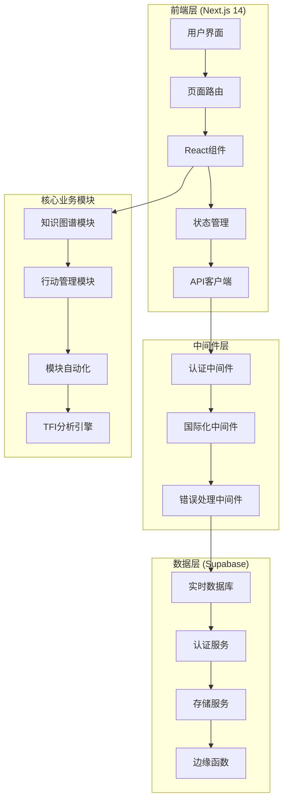
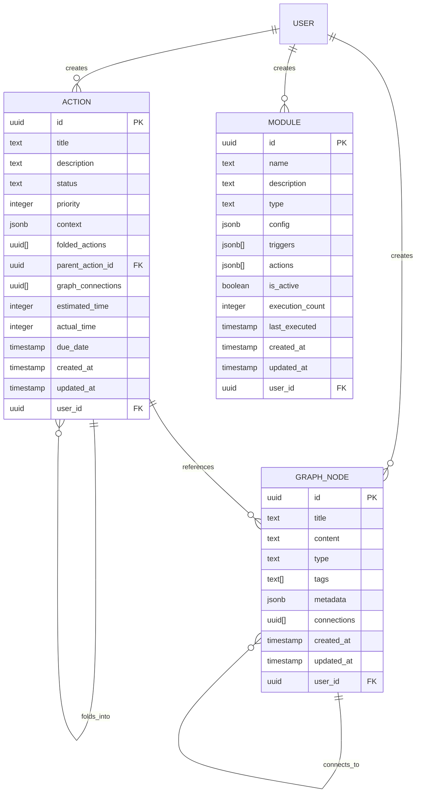

# TimeWeave 核心系统设计文档

## 概述

TimeWeave 是一个基于 Next.js 14 和 Supabase 构建的现代生产力管理平台，采用"时间编织"理念，通过三个核心维度重构用户生产力。系统采用模块化架构，支持实时数据同步、多语言国际化和响应式设计。

### 核心理念
- **过去可重写** - 通过知识图谱系统管理和重构历史信息
- **现在可折叠** - 通过行动管理系统优化当前工作流程
- **未来可预编译** - 通过模块自动化系统预设未来流程

## 架构设计

### 系统架构图



### 技术栈

**前端技术栈:**
- Next.js 14 (App Router)
- React 19 + TypeScript
- Tailwind CSS + Radix UI
- Recharts (数据可视化)
- React Hook Form + Zod (表单验证)

**后端技术栈:**
- Supabase (BaaS)
- PostgreSQL (数据库)
- Row Level Security (数据安全)
- Real-time Subscriptions (实时更新)

**开发工具:**
- TypeScript (类型安全)
- ESLint + Prettier (代码规范)
- Vercel (部署平台)

## 组件架构

### 页面层级结构

```
app/
├── layout.tsx                 # 根布局
├── page.tsx                   # 首页/登录页
├── auth/
│   ├── login/page.tsx         # 登录页面
│   ├── signup/page.tsx        # 注册页面
│   └── callback/route.ts      # OAuth回调
├── dashboard/page.tsx         # TFI仪表盘
├── graph/page.tsx             # 知识图谱
├── actions/page.tsx           # 行动管理
├── modules/page.tsx           # 模块自动化
├── workbench/page.tsx         # 统一工作台
└── guide/page.tsx             # 用户指南
```

### 组件设计模式

**1. 容器组件模式**
- Dashboard组件负责数据获取和状态管理
- 展示组件专注于UI渲染和用户交互
- 通过props传递数据和回调函数

**2. 复合组件模式**
- Card组件系统 (Card, CardHeader, CardContent)
- Form组件系统 (Input, Button, Label)
- Modal组件系统 (Dialog, Sheet, Popover)

**3. 自定义Hook模式**
- useTranslation (国际化)
- useLanguage (语言管理)
- useSupabase (数据库操作)

## 数据模型设计

### 核心实体关系图



### 数据类型定义

```typescript
// 知识图谱节点
interface GraphNode {
  id: string
  title: string
  content?: string
  type: 'note' | 'document' | 'reference' | 'template'
  tags: string[]
  metadata: Record<string, any>
  connections: string[]
  created_at: string
  updated_at: string
  user_id: string
}

// 行动项
interface Action {
  id: string
  title: string
  description?: string
  status: 'pending' | 'active' | 'folded' | 'completed'
  priority: 1 | 2 | 3 | 4 | 5
  context: Record<string, any>
  folded_actions: string[]
  parent_action_id?: string
  graph_connections: string[]
  estimated_time?: number
  actual_time?: number
  due_date?: string
  created_at: string
  updated_at: string
  user_id: string
}

// 自动化模块
interface Module {
  id: string
  name: string
  description?: string
  type: 'template' | 'automation' | 'trigger' | 'workflow'
  config: Record<string, any>
  triggers: TriggerConfig[]
  actions: ActionConfig[]
  is_active: boolean
  execution_count: number
  last_executed?: string
  created_at: string
  updated_at: string
  user_id: string
}

// TFI数据
interface TFIData {
  tfi_score: number
  graph_nodes: number
  active_actions: number
  folded_actions: number
  active_modules: number
  calculated_at: string
}
```

## 接口设计

### API设计原则

1. **RESTful设计** - 使用标准HTTP方法和状态码
2. **统一响应格式** - 所有API返回一致的数据结构
3. **错误处理** - 提供详细的错误信息和恢复建议
4. **分页支持** - 大数据集使用分页和虚拟滚动
5. **实时更新** - 关键数据使用WebSocket实时同步

### Supabase API接口

**知识图谱API:**
```typescript
// 获取节点列表
GET /rest/v1/graph?select=*&order=updated_at.desc

// 创建节点
POST /rest/v1/graph
Body: { title, content, type, tags, metadata }

// 更新节点
PATCH /rest/v1/graph?id=eq.{id}
Body: { title?, content?, tags?, metadata? }

// 删除节点
DELETE /rest/v1/graph?id=eq.{id}

// 搜索节点
GET /rest/v1/graph?or=(title.ilike.*{query}*,content.ilike.*{query}*)
```

**行动管理API:**
```typescript
// 获取行动列表
GET /rest/v1/actions?select=*&order=updated_at.desc

// 创建行动
POST /rest/v1/actions
Body: { title, description, status, priority, estimated_time }

// 折叠行动
POST /rest/v1/actions
Body: { 
  title: "Folded: {parent_title}",
  status: "folded",
  folded_actions: [id1, id2, ...],
  context: { folding_strategy, combined_time }
}

// 更新行动状态
PATCH /rest/v1/actions?id=eq.{id}
Body: { status, actual_time?, completed_at? }
```

**模块自动化API:**
```typescript
// 获取模块列表
GET /rest/v1/modules?select=*&is_active=eq.true

// 创建模块
POST /rest/v1/modules
Body: { name, description, type, config, triggers, actions }

// 执行模块
POST /rest/v1/rpc/execute_module
Body: { module_id, context }

// 获取执行历史
GET /rest/v1/module_executions?module_id=eq.{id}&order=executed_at.desc
```

**TFI分析API:**
```typescript
// 计算TFI指数
POST /rest/v1/rpc/calculate_tfi
Response: {
  tfi_score: number,
  graph_nodes: number,
  active_actions: number,
  folded_actions: number,
  active_modules: number,
  calculated_at: string
}

// 获取趋势数据
GET /rest/v1/tfi_history?user_id=eq.{id}&order=calculated_at.desc&limit=30
```

## 用户界面设计

### 设计系统

**颜色方案:**
```css
/* 主色调 - 深色主题 */
--background: #0f172a;      /* slate-950 */
--surface: #1e293b;        /* slate-800 */
--surface-variant: #334155; /* slate-700 */

/* 强调色 */
--primary: #f59e0b;        /* amber-500 */
--primary-hover: #d97706;  /* amber-600 */
--secondary: #3b82f6;      /* blue-500 */
--accent: #8b5cf6;         /* violet-500 */
--success: #10b981;        /* emerald-500 */

/* 文本颜色 */
--text-primary: #f8fafc;   /* slate-50 */
--text-secondary: #cbd5e1; /* slate-300 */
--text-muted: #64748b;     /* slate-500 */
```

**字体系统:**
```css
/* 字体族 */
--font-sans: 'Geist Sans', system-ui, sans-serif;
--font-mono: 'Geist Mono', 'Fira Code', monospace;

/* 字体大小 */
--text-xs: 0.75rem;    /* 12px */
--text-sm: 0.875rem;   /* 14px */
--text-base: 1rem;     /* 16px */
--text-lg: 1.125rem;   /* 18px */
--text-xl: 1.25rem;    /* 20px */
--text-2xl: 1.5rem;    /* 24px */
--text-3xl: 1.875rem;  /* 30px */
--text-4xl: 2.25rem;   /* 36px */
```

**间距系统:**
```css
/* 间距单位 (基于 4px) */
--space-1: 0.25rem;    /* 4px */
--space-2: 0.5rem;     /* 8px */
--space-3: 0.75rem;    /* 12px */
--space-4: 1rem;       /* 16px */
--space-6: 1.5rem;     /* 24px */
--space-8: 2rem;       /* 32px */
--space-12: 3rem;      /* 48px */
--space-16: 4rem;      /* 64px */
```

### 响应式设计

**断点系统:**
```css
/* 移动设备优先 */
@media (min-width: 640px)  { /* sm */ }
@media (min-width: 768px)  { /* md */ }
@media (min-width: 1024px) { /* lg */ }
@media (min-width: 1280px) { /* xl */ }
@media (min-width: 1536px) { /* 2xl */ }
```

**布局适配:**
- **移动端 (< 768px)**: 单列布局，底部导航，手势操作
- **平板端 (768px - 1024px)**: 双列布局，侧边导航，触摸优化
- **桌面端 (> 1024px)**: 多列布局，顶部导航，键盘快捷键

### 组件库设计

**基础组件:**
```typescript
// 按钮组件
interface ButtonProps {
  variant: 'default' | 'outline' | 'ghost' | 'destructive'
  size: 'sm' | 'md' | 'lg'
  disabled?: boolean
  loading?: boolean
  icon?: React.ComponentType
  children: React.ReactNode
}

// 卡片组件
interface CardProps {
  variant: 'default' | 'elevated' | 'outlined'
  padding: 'sm' | 'md' | 'lg'
  interactive?: boolean
  children: React.ReactNode
}

// 输入组件
interface InputProps {
  type: 'text' | 'email' | 'password' | 'search'
  placeholder?: string
  error?: string
  icon?: React.ComponentType
  value: string
  onChange: (value: string) => void
}
```

## 错误处理

### 错误分类

**1. 网络错误**
- 连接超时
- 服务器不可用
- 网络中断

**2. 认证错误**
- 未登录
- 会话过期
- 权限不足

**3. 数据错误**
- 验证失败
- 数据冲突
- 约束违反

**4. 业务错误**
- 操作不允许
- 资源不存在
- 状态不匹配

### 错误处理策略

```typescript
// 全局错误处理器
class ErrorHandler {
  static handle(error: Error, context: string) {
    // 记录错误
    console.error(`[${context}]`, error)
    
    // 分类处理
    if (error instanceof NetworkError) {
      return this.handleNetworkError(error)
    } else if (error instanceof AuthError) {
      return this.handleAuthError(error)
    } else if (error instanceof ValidationError) {
      return this.handleValidationError(error)
    } else {
      return this.handleUnknownError(error)
    }
  }
  
  static handleNetworkError(error: NetworkError) {
    toast.error('网络连接异常，请检查网络设置')
    return { retry: true, fallback: 'offline' }
  }
  
  static handleAuthError(error: AuthError) {
    toast.error('登录已过期，请重新登录')
    router.push('/auth/login')
    return { retry: false, fallback: 'login' }
  }
}
```

## 测试策略

### 测试金字塔

**1. 单元测试 (70%)**
- 工具函数测试
- 组件逻辑测试
- Hook测试
- 数据转换测试

**2. 集成测试 (20%)**
- API集成测试
- 组件交互测试
- 路由测试
- 状态管理测试

**3. 端到端测试 (10%)**
- 用户流程测试
- 跨浏览器测试
- 性能测试
- 可访问性测试

### 测试工具

```typescript
// 测试配置
{
  "testFramework": "Jest + React Testing Library",
  "e2eFramework": "Playwright",
  "coverage": "Istanbul",
  "mocking": "MSW (Mock Service Worker)"
}
```

## 性能优化

### 前端优化

**1. 代码分割**
```typescript
// 路由级别代码分割
const GraphDashboard = lazy(() => import('@/components/graph-dashboard'))
const ActionsDashboard = lazy(() => import('@/components/actions-dashboard'))

// 组件级别代码分割
const HeavyComponent = lazy(() => import('@/components/heavy-component'))
```

**2. 数据获取优化**
```typescript
// SWR缓存策略
const { data, error, mutate } = useSWR(
  `/api/graph/nodes`,
  fetcher,
  {
    revalidateOnFocus: false,
    revalidateOnReconnect: true,
    dedupingInterval: 5000
  }
)

// 虚拟滚动
const VirtualizedList = ({ items }) => {
  return (
    <FixedSizeList
      height={600}
      itemCount={items.length}
      itemSize={80}
      itemData={items}
    >
      {Row}
    </FixedSizeList>
  )
}
```

**3. 图片优化**
```typescript
// Next.js Image组件
<Image
  src="/placeholder.jpg"
  alt="Placeholder"
  width={300}
  height={200}
  placeholder="blur"
  blurDataURL="data:image/jpeg;base64,..."
  priority={isAboveFold}
/>
```

### 数据库优化

**1. 索引策略**
```sql
-- 复合索引
CREATE INDEX idx_graph_user_type_updated 
ON graph(user_id, type, updated_at DESC);

-- 部分索引
CREATE INDEX idx_actions_active 
ON actions(user_id, updated_at DESC) 
WHERE status IN ('pending', 'active');

-- GIN索引用于数组和JSONB
CREATE INDEX idx_graph_tags ON graph USING GIN(tags);
CREATE INDEX idx_actions_metadata ON actions USING GIN(metadata);
```

**2. 查询优化**
```sql
-- 使用CTE优化复杂查询
WITH folded_action_stats AS (
  SELECT 
    user_id,
    COUNT(*) as folded_count,
    AVG(array_length(folded_actions, 1)) as avg_fold_size
  FROM actions 
  WHERE status = 'folded' 
  GROUP BY user_id
)
SELECT 
  u.id,
  u.email,
  COALESCE(fas.folded_count, 0) as folded_actions,
  COALESCE(fas.avg_fold_size, 0) as avg_fold_size
FROM users u
LEFT JOIN folded_action_stats fas ON u.id = fas.user_id;
```

## 安全设计

### 认证与授权

**1. Row Level Security (RLS)**
```sql
-- 用户只能访问自己的数据
CREATE POLICY "Users can only access their own graph nodes"
ON graph FOR ALL
USING (auth.uid() = user_id);

CREATE POLICY "Users can only access their own actions"
ON actions FOR ALL
USING (auth.uid() = user_id);

CREATE POLICY "Users can only access their own modules"
ON modules FOR ALL
USING (auth.uid() = user_id);
```

**2. 输入验证**
```typescript
// Zod验证模式
const GraphNodeSchema = z.object({
  title: z.string().min(1).max(200),
  content: z.string().max(10000).optional(),
  type: z.enum(['note', 'document', 'reference', 'template']),
  tags: z.array(z.string().max(50)).max(20),
  metadata: z.record(z.any()).optional()
})

// 服务端验证
export async function createGraphNode(data: unknown) {
  const validated = GraphNodeSchema.parse(data)
  // 处理验证后的数据
}
```

**3. XSS防护**
```typescript
// 内容清理
import DOMPurify from 'dompurify'

const sanitizeContent = (content: string) => {
  return DOMPurify.sanitize(content, {
    ALLOWED_TAGS: ['p', 'br', 'strong', 'em', 'ul', 'ol', 'li'],
    ALLOWED_ATTR: []
  })
}
```

### 数据保护

**1. 敏感数据加密**
```sql
-- 使用pgcrypto扩展
CREATE EXTENSION IF NOT EXISTS pgcrypto;

-- 加密敏感字段
CREATE OR REPLACE FUNCTION encrypt_sensitive_data()
RETURNS TRIGGER AS $$
BEGIN
  IF NEW.sensitive_field IS NOT NULL THEN
    NEW.sensitive_field = crypt(NEW.sensitive_field, gen_salt('bf'));
  END IF;
  RETURN NEW;
END;
$$ LANGUAGE plpgsql;
```

**2. 审计日志**
```sql
-- 审计表
CREATE TABLE audit_log (
  id UUID DEFAULT gen_random_uuid() PRIMARY KEY,
  table_name TEXT NOT NULL,
  operation TEXT NOT NULL,
  old_values JSONB,
  new_values JSONB,
  user_id UUID,
  timestamp TIMESTAMP WITH TIME ZONE DEFAULT NOW()
);

-- 审计触发器
CREATE OR REPLACE FUNCTION audit_trigger()
RETURNS TRIGGER AS $$
BEGIN
  INSERT INTO audit_log (table_name, operation, old_values, new_values, user_id)
  VALUES (
    TG_TABLE_NAME,
    TG_OP,
    CASE WHEN TG_OP = 'DELETE' THEN row_to_json(OLD) ELSE NULL END,
    CASE WHEN TG_OP IN ('INSERT', 'UPDATE') THEN row_to_json(NEW) ELSE NULL END,
    auth.uid()
  );
  RETURN COALESCE(NEW, OLD);
END;
$$ LANGUAGE plpgsql;
```

## 国际化设计

### 多语言支持架构

**1. 翻译文件结构**
```typescript
// lib/i18n.ts
export const translations = {
  en: {
    nav: { dashboard: "Dashboard", graph: "Graph" },
    common: { create: "Create", edit: "Edit" },
    graph: { title: "Knowledge Graph" },
    actions: { title: "Actions" },
    modules: { title: "Modules" }
  },
  zh: {
    nav: { dashboard: "仪表盘", graph: "知识图谱" },
    common: { create: "创建", edit: "编辑" },
    graph: { title: "知识图谱" },
    actions: { title: "行动管理" },
    modules: { title: "模块自动化" }
  }
}
```

**2. 语言检测与切换**
```typescript
// 自动检测浏览器语言
export function detectLanguage(): Language {
  if (typeof window !== "undefined") {
    const browserLang = navigator.language.toLowerCase()
    return browserLang.startsWith("zh") ? "zh" : "en"
  }
  return "en"
}

// 语言切换Hook
export function useLanguage() {
  const [language, setLanguage] = useState<Language>("en")
  
  const changeLanguage = (newLanguage: Language) => {
    setLanguage(newLanguage)
    localStorage.setItem("timeweave-language", newLanguage)
  }
  
  return { language, changeLanguage, t: useTranslation(language) }
}
```

**3. 日期时间本地化**
```typescript
// 日期格式化
export function formatDate(date: string, language: Language) {
  const locale = language === 'zh' ? 'zh-CN' : 'en-US'
  return new Intl.DateTimeFormat(locale, {
    year: 'numeric',
    month: 'long',
    day: 'numeric',
    hour: '2-digit',
    minute: '2-digit'
  }).format(new Date(date))
}
```

## 部署架构

### Vercel部署配置

```json
// vercel.json
{
  "framework": "nextjs",
  "buildCommand": "npm run build",
  "devCommand": "npm run dev",
  "installCommand": "npm install",
  "env": {
    "NEXT_PUBLIC_SUPABASE_URL": "@supabase-url",
    "NEXT_PUBLIC_SUPABASE_ANON_KEY": "@supabase-anon-key"
  },
  "functions": {
    "app/api/**/*.ts": {
      "maxDuration": 30
    }
  },
  "headers": [
    {
      "source": "/(.*)",
      "headers": [
        {
          "key": "X-Content-Type-Options",
          "value": "nosniff"
        },
        {
          "key": "X-Frame-Options",
          "value": "DENY"
        },
        {
          "key": "X-XSS-Protection",
          "value": "1; mode=block"
        }
      ]
    }
  ]
}
```

### 环境配置

```bash
# .env.local
NEXT_PUBLIC_SUPABASE_URL=https://your-project.supabase.co
NEXT_PUBLIC_SUPABASE_ANON_KEY=your-anon-key
SUPABASE_SERVICE_ROLE_KEY=your-service-role-key

# 生产环境额外配置
NEXT_PUBLIC_APP_URL=https://timeweave.app
NEXT_PUBLIC_ANALYTICS_ID=your-analytics-id
```

### 监控与日志

```typescript
// 错误监控
import * as Sentry from "@sentry/nextjs"

Sentry.init({
  dsn: process.env.NEXT_PUBLIC_SENTRY_DSN,
  environment: process.env.NODE_ENV,
  tracesSampleRate: 0.1,
  beforeSend(event) {
    // 过滤敏感信息
    if (event.user) {
      delete event.user.email
    }
    return event
  }
})

// 性能监控
export function trackPerformance(name: string, fn: () => Promise<any>) {
  const start = performance.now()
  return fn().finally(() => {
    const duration = performance.now() - start
    console.log(`[Performance] ${name}: ${duration.toFixed(2)}ms`)
  })
}
```

这个设计文档涵盖了 TimeWeave 系统的完整技术架构，包括前端组件设计、数据模型、API接口、用户界面、性能优化、安全设计、国际化支持和部署架构。设计基于现有代码结构，确保了实现的可行性和一致性。